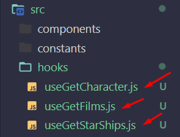
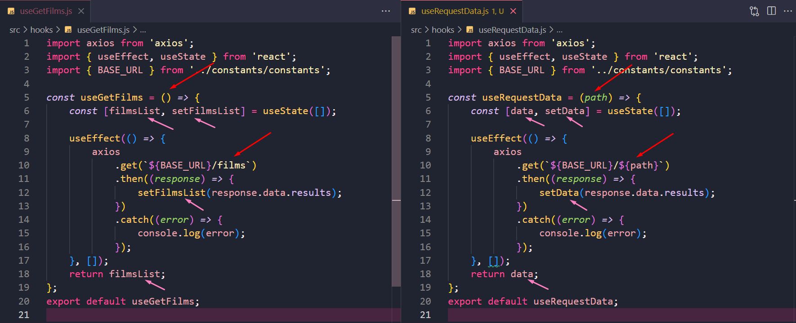

# Custom Hooks - Exercícios

## Índice

-   [1. Exercício 1](#exercício-1)
-   [2. Exercício 2](#exercício-2)
-   [3. Exercício 3](#exercício-3)

---

No exercicios de hoje vamos utilizar a API do Star Wars. Ela é uma API pública que fornece dados relacionados ao universo Star Wars, incluindo informações sobre filmes, personagens, planetas, naves espaciais, espécies e muito mais.
https://swapi.dev/

No exercício de hoje você deverá criar um Custom Hook de requisição que seja reutilizado nas três páginas do site: filmes(FilmListPage.js), personagens(CharactersListPage.js) e naves(StarShipsListPage.js) do Star Wars.

## Exercício 1

### Enunciado

Extraia a lógica das requisições já existente no template e construa três custom hooks:

-   **useGetFilms** (Custom Hook para pegar os filmes do Star Wars)
-   **useGetCharacter** (Custom Hook para pegar o nome dos personagens do Star Wars)
-   **useGetStarShips** (Custom Hook para pegar as naves do Star Wars)

### Resolução

Em `src` criei a pasta `hooks` e dentro dela criei três arquivos, cada uma com o nome da função que eu irei criar dentro delas:


-   Construindo o hook `useGetFilms`:

    -   Construi uma função `useGetFilms` e exportei:

        ```
        const useGetFilms = () => {

        };
        export default useGetFilms;
        ```

    -   Copiei a lógica de `FilmListPage.js` e coloquei dentro da função anterior fazendo as adaptações necessárias, dessa forma `useGetFilms.js` fica da seguinte maneira:

        ```
        import axios from 'axios';
        import { useEffect, useState } from 'react';
        import { BASE_URL } from '../constants/constants';

        const useGetFilms = () => {
            const [filmsList, setFilmsList] = useState([]);

            useEffect(() => {
                axios
                    .get(`${BASE_URL}/films`)
                    .then((response) => {
                        setFilmsList(response.data.results);
                    })
                    .catch((error) => {
                        console.log(error);
                    });
            }, []);
            return filmsList;
        };
        export default useGetFilms;
        ```

-   Adaptando o hook `useGetFilms` dentro do arquivo `FilmListPage.js`:

    -   Preciso importar o hook `useGetFilmes`
        ```
        import useGetFilms from '../hooks/useGetFilms';
        ```
    -   Criei uma variável com o mesmo nome do array que estava sendo renderizado pelo map no jsx e o seu valor é o hook importado:
        ```
        const filmsList = useGetFilms();
        ```
    -   Dessa forma o `FilmListPage.js` fica da seguinte maneira:

        ```
        import { Title, PostContainer } from './style';
        import { Card } from '../components/Card/Card';
        import useGetFilms from '../hooks/useGetFilms';

        const FilmListPage = () => {
            const filmsList = useGetFilms();

            return (
                <div>
                    <Title>Título dos filmes</Title>
                    <PostContainer>
                        {filmsList.map((film) => {
                            return (
                                <Card
                                    key={film.title}
                                    title={film.title}
                                    text={film.opening_crawl}
                                    backgroudColor={'gray'}
                                    textColor={'#ffffff'}
                                />
                            );
                        })}
                    </PostContainer>
                </div>
            );
        };

        export default FilmListPage;
        ```

-   Fiz exatamente o mesmo procedimento para cada um dos novos hooks que criei e a adaptação nas suas respectivas páginas.

## Exercício 2

### Enunciado

-   Utilize o exemplo do **useRequestData do material assíncrono** e reorganize o código do exercício 1, de modo a permitir a reutilização da lógica para todas as requisições projeto.

### Resolução

-   Em `hooks`, criei o arquivo `useRequestData.js` e dentro dele uma função:

    ```
    const useRequestData = () => {

    };
    export default useRequestData;
    ```

-   Utilizando como exemplo o hook `useGetFilms` adaptei seu código para torna-lo utilizável em todas as três páginas, as adaptações feitas estão identificadas pelas setas na imagem:
    

-   Em seguida chamei o novo hook `useRequestData` em todos as páginas substituindo os hooks anteriormente criados:

    -   Chamando o hook `useRequestData` em `FilmListPage.js`:
        -   Importei:
            ```
            import useRequestData from '../hooks/useRequestData';
            ```
        -   Chamei:
            ```
            const filmsList = useRequestData('/films');
            ```
    -   Chamando o hook `useRequestData` em `CharactersListPage.js`:

        -   Importei:

            ```
            import useRequestData from '../hooks/useRequestData';
            ```

        -   Chamei:

            ```
            const caractersList = useRequestData('/people');
            ```

    -   Chamando o hook `useRequestData` em `StarShipsListPage.js`:

        -   Importei:

            ```
            import useRequestData from '../hooks/useRequestData';
            ```

        -   Chamei:

            ```
            const starShipsList = useRequestData('/starships');
            ```

## Exercício 3

### Enunciado

Atualize o **useRequestData** do exercício anterior:

-   Faça o tratamento de erros: ele deve mostrar os erros de requisição para o usuário.
-   Adicione um indicador de carregamento: o usuário deve saber que os dados estão sendo carregados.
-   Utilize o nome "isLoading" como variável de estado.

### Resolução
